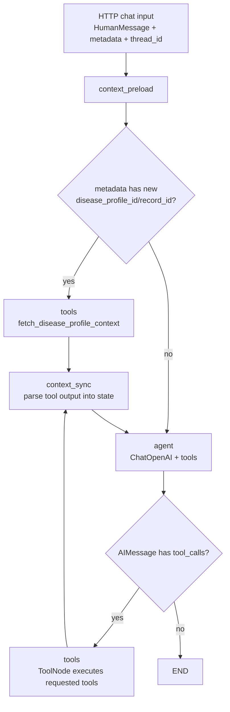
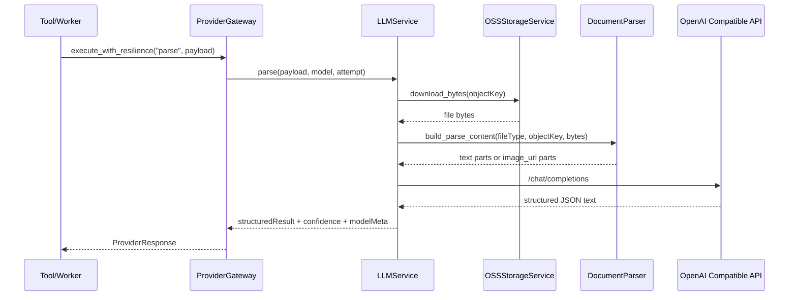
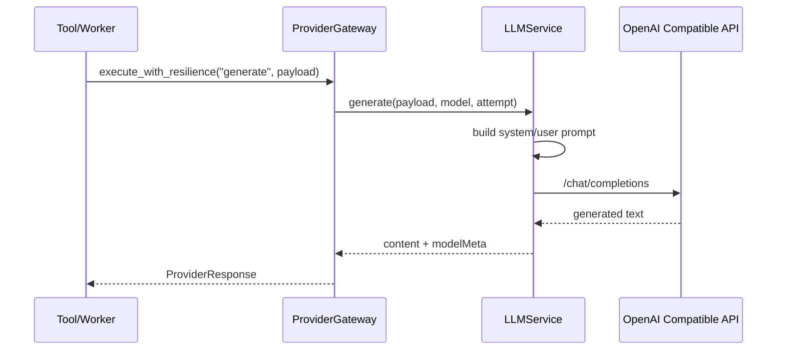
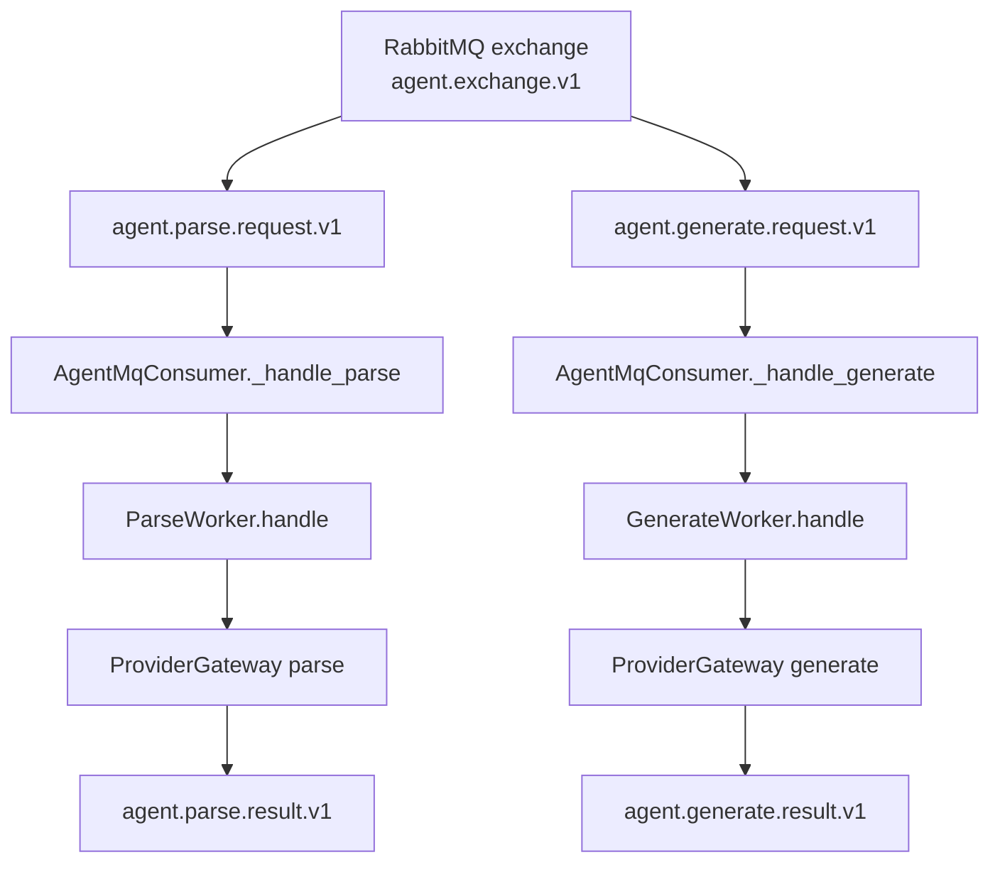
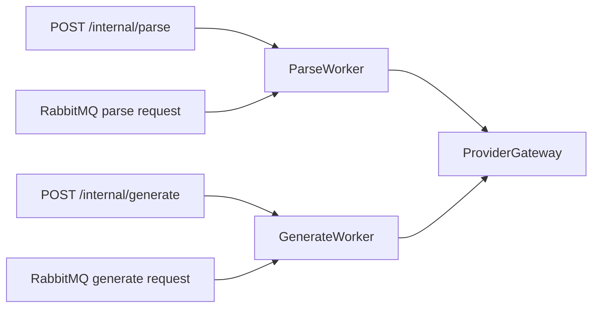
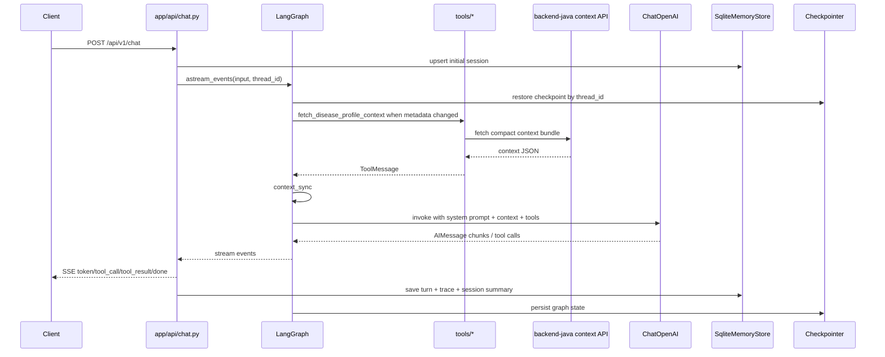
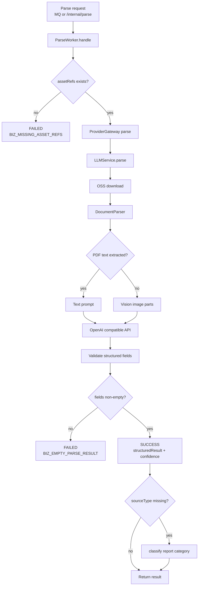

# backend-agent 项目 Review 路径

> 生成日期：2026-05-07  
> 适用范围：`backend-agent` 当前 Python FastAPI + LangGraph Agent 服务  
> 目标读者：准备接手、熟悉、评审或二次开发当前 Agent 项目的工程师

## 一、Review 前提

### 1.1 明确假设

- 当前项目重点是 Python 后端 `backend-agent`，不是 Java 后端或前端。
- 需要掌握的不是单个函数，而是：服务启动、Agent 对话、会话记忆、工具调用、Provider 调用、MQ 任务处理、测试验证这几条主线。
- 文档按“先建立系统地图，再读核心链路，再读专项模块”的路径组织。
- 当前仓库已有 `docs/project-structure.md`，本文不替代它，而是作为实际读代码时的 review 路线图。

### 1.2 成功标准

完成本文路径后，应该能回答：

- 服务从 `app/main.py` 启动后创建了哪些依赖，分别放在哪里。
- `/api/v1/chat` 一次 SSE 对话如何进入 LangGraph、如何流式返回、如何保存会话。
- Agent 什么时候自动获取疾病档案上下文，什么时候调用文档解析或文本生成工具。
- `tools/`、`providers/`、`workers/` 的边界分别是什么。
- 短期记忆和长期会话索引分别落在哪个 SQLite 文件。
- MQ 解析和生成任务如何消费、处理、发布结果。
- 修改某条链路时应优先补哪些测试。

## 二、项目总览

### 2.1 技术栈

| 方向 | 当前实现 |
| --- | --- |
| Web 服务 | FastAPI + Uvicorn |
| Agent 编排 | LangGraph + LangChain |
| LLM 接入 | `langchain-openai` 与 OpenAI 兼容 Chat Completions |
| 流式输出 | Server-Sent Events |
| 短期记忆 | `langgraph-checkpoint-sqlite` |
| 会话索引 | `aiosqlite` 自建表 |
| 异步任务 | RabbitMQ + `aio-pika` |
| 文件存储 | 阿里云 OSS |
| 文档解析 | `pypdf` 文本提取 + PyMuPDF 图片渲染 + Vision LLM |
| 测试 | pytest |

### 2.2 目录地图

```text
app/
  main.py                 FastAPI 入口、依赖装配、生命周期、内部任务端点
  config.py               环境变量读取和应用配置
  api/
    chat.py               SSE 对话端点
    sessions.py           会话 CRUD 端点
  agent/
    graph.py              LangGraph 状态图构建
    nodes.py              上下文预加载、LLM 调用、工具执行、路由条件
    context.py            疾病档案上下文签名、解析、系统消息构造
    state.py              AgentState 类型定义
  tools/
    registry.py           工具注册表
    disease_profile_context.py  从 Java 后端获取疾病档案上下文
    document_parse.py     Agent 文档解析工具
    text_generate.py      Agent 医疗文本生成工具
  providers/
    gateway.py            Provider 弹性编排、重试、错误分类
    llm.py                OpenAI 兼容调用、解析/生成提示词、结构化输出
    document.py           PDF/图片转 OpenAI 多模态输入
    storage.py            OSS 下载和文件限制
  memory/
    checkpointer.py       LangGraph checkpoint 短期记忆
    store.py              SQLite 会话索引和 turn 存储
    models.py             会话、turn、trace 数据模型
  workers/
    parse_worker.py       MQ/内部 HTTP 文档解析任务处理
    generate_worker.py    MQ/内部 HTTP 文本生成任务处理
  mq/
    consumer.py           RabbitMQ 连接、队列订阅、结果发布
tests/
  test_api/               HTTP API 测试
  test_agent/             Agent 图、节点、上下文、错误恢复测试
  test_providers/         Provider / LLM / OCR / storage 测试
  test_workers/           worker 边界测试
```

## 三、推荐 Review 路径

### 第 1 步：先读运行入口和依赖装配

阅读文件：

- `app/main.py`
- `app/config.py`
- `.env.example`
- `pyproject.toml`
- `start-backend-agent.ps1`

关注问题：

- 应用启动时创建了哪些单例：`OSSStorageService`、`DocumentParser`、`LLMService`、`ProviderGateway`、`ParseWorker`、`GenerateWorker`、`AgentMqConsumer`。
- `main.py` 如何把 gateway/client 注入到 `tools/` 模块级变量。
- `lifespan()` 中如何创建 LangGraph checkpointer、`SqliteMemoryStore` 和 compiled graph。
- `MQ_CONSUMER_ENABLED` 如何控制 MQ 消费者是否启动。
- 线程池和并发限制由 `WORKER_THREAD_POOL_SIZE`、`MAX_CONCURRENT_TASKS` 控制。

验证方式：

```powershell
pytest
```

局部验证可先跑：

```powershell
pytest tests/test_providers tests/test_agent tests/test_api
```

### 第 2 步：读 HTTP 对话入口

阅读文件：

- `app/api/chat.py`
- `app/schemas/chat.py`
- `app/api/sessions.py`

重点链路：

1. 客户端 `POST /api/v1/chat`。
2. `ChatRequest` 提供 `thread_id`、`message`、`metadata`、`attachments`。
3. 如果没有 `thread_id`，`chat.py` 用 `new_ordered_id()` 创建新会话。
4. 将 `X-Patient-Id` 请求头补进 metadata，供后续上下文工具使用。
5. 调用 `graph.astream_events(..., version="v2")`。
6. 将 LangChain/LangGraph 事件转换成 SSE 事件：
   - `session`
   - `token`
   - `tool_call`
   - `tool_result`
   - `done`
   - `error`
7. finally 阶段保存 turn、trace_events、session 元数据。

需要特别注意：

- 当前 `ChatRequest.attachments` 已定义，但 `chat.py` 没有直接把附件自动转成工具调用；文档解析依赖 Agent 根据消息和可用参数调用 `parse_document`。
- SSE 中 keepalive 间隔为 15 秒。
- 失败时会保存 `error_message`，并尽量把底层异常转成用户友好提示。

### 第 3 步：读 LangGraph 状态图

阅读文件：

- `app/agent/graph.py`
- `app/agent/nodes.py`
- `app/agent/context.py`
- `app/agent/state.py`

核心图：



读代码时按这个顺序看：

1. `build_graph()`：节点和边的定义。
2. `create_context_preload_node()`：根据 metadata 构造上下文工具调用。
3. `should_run_preload_tools()`：决定是否先跑工具。
4. `create_context_sync_node()`：把工具返回 JSON 同步成 `active_context_bundle/status`。
5. `create_llm_node()`：组装 system prompt、上下文 system message、场景 prompt、工具错误提示，然后调用 `ChatOpenAI`。
6. `should_continue()`：根据 `AIMessage.tool_calls` 决定继续工具调用还是结束。

关键状态字段：

| 字段 | 含义 |
| --- | --- |
| `messages` | LangChain 消息历史，LangGraph 会随 checkpoint 持久化 |
| `thread_id` | 会话标识，通过 config configurable 传入 checkpointer |
| `metadata` | 当前轮对话元数据，包含疾病档案、记录、场景、用户范围等 |
| `pending_context_signature` | 本轮需要加载但尚未同步的上下文签名 |
| `active_context_signature` | 当前图状态已缓存的上下文签名 |
| `active_context_bundle` | Java 后端返回并解析后的疾病档案上下文 |
| `active_context_status` | `ready`、`partial`、`unavailable` |

### 第 4 步：读工具层边界

阅读文件：

- `app/tools/registry.py`
- `app/tools/disease_profile_context.py`
- `app/tools/document_parse.py`
- `app/tools/text_generate.py`
- `app/services/disease_profile_context.py`

工具表：

| 工具 | 触发场景 | 下游依赖 | 返回 |
| --- | --- | --- | --- |
| `fetch_disease_profile_context` | 系统根据 metadata 自动预加载疾病档案上下文 | Java 后端内部 API | JSON 文本 |
| `parse_document` | 用户明确要解析 OSS 文档 | `ProviderGateway.execute_with_resilience("parse")` | 指标文本或错误文本 |
| `generate_medical_text` | 用户要求生成摘要、用药方案、报告分析草稿 | `ProviderGateway.execute_with_resilience("generate")` | 生成文本或错误文本 |

边界判断：

- `tools/` 只负责把底层服务包装成 Agent 可调用工具。
- 真正的下载、解析、LLM 调用不应该写在工具里。
- 新增工具时通常只改：新工具文件 + `registry.py`。

### 第 5 步：读 Provider 层

阅读文件：

- `app/providers/gateway.py`
- `app/providers/llm.py`
- `app/providers/document.py`
- `app/providers/storage.py`

Provider 解析链路：



Provider 生成链路：



重点理解：

- `ProviderGateway` 负责重试、退避、错误分类，不负责业务解析。
- `LLMService.parse()` 负责把报告解析成结构化字段。
- `LLMService.generate()` 负责摘要、报告分析、用药方案等文本草稿。
- `DocumentParser` 对 PDF 先尝试文本提取，失败后渲染前几页给 Vision 模型。
- `OSSStorageService` 只处理 OSS 配置、下载、空文件和大小限制。

错误码规则：

- `BIZ_*`：业务/输入/配置类问题，通常不重试。
- `EXT_*`：外部服务、网络、超时类问题，通常可重试。

### 第 6 步：读记忆和会话存储

阅读文件：

- `app/memory/checkpointer.py`
- `app/memory/store.py`
- `app/memory/models.py`
- `app/api/sessions.py`

两类存储：

| 存储 | 文件 | 作用 | 主要使用方 |
| --- | --- | --- | --- |
| 短期记忆 checkpoint | `data/checkpoints.db` | LangGraph 消息状态和图状态恢复 | LangGraph checkpointer |
| 会话索引 memory | `data/memory.db` | 会话列表、turn、trace、标题、预览、上下文状态 | `chat.py`、`sessions.py` |

会话读取优先级：

1. `GET /api/v1/sessions/{thread_id}` 优先从 `SqliteMemoryStore` 读取 indexed session 和 turns。
2. 如果 memory store 找不到，再尝试从 graph checkpoint 读取原始 messages。

注意点：

- `DELETE /api/v1/sessions/{thread_id}` 删除 memory store 里的 session/turn。
- LangGraph checkpoint 删除当前只是尽力而为说明，代码中没有标准删除 API 调用。

### 第 7 步：读 MQ 和内部任务链路

阅读文件：

- `app/mq/consumer.py`
- `app/workers/parse_worker.py`
- `app/workers/generate_worker.py`
- `app/main.py` 中 `/internal/parse`、`/internal/generate`

MQ 流程图：



内部 HTTP 与 MQ 共用 worker：



关注问题：

- MQ 队列名和 routing key 固定为 `agent.parse.request.v1`、`agent.generate.request.v1`、`agent.parse.result.v1`、`agent.generate.result.v1`。
- `ParseWorker` 在未传 `sourceType` 时，会额外调用 `classify_report_category()` 自动分类。
- `GenerateWorker` 要求 `recordId`，否则返回 `BIZ_MISSING_RECORD_ID`。
- 两个 worker 都可以通过共享 semaphore 控制并发。

## 四、端到端流程图

### 4.1 Agent SSE 对话



### 4.2 文档解析任务



## 五、建议阅读顺序清单

按下面顺序读，避免一开始陷入细节：

1. `pyproject.toml`：确认依赖和 Python 版本。
2. `.env.example`：确认运行需要哪些外部配置。
3. `app/main.py`：建立启动和依赖装配地图。
4. `app/api/chat.py`：理解用户请求如何进入 Agent。
5. `app/agent/graph.py`：理解 LangGraph 拓扑。
6. `app/agent/nodes.py`：理解上下文预加载、LLM 调用、工具循环。
7. `app/agent/context.py`：理解疾病档案上下文如何变成系统消息。
8. `app/tools/registry.py`：确认 Agent 可用工具全集。
9. `app/tools/disease_profile_context.py`：理解自动上下文工具。
10. `app/providers/gateway.py`：理解错误分类和重试策略。
11. `app/providers/llm.py`：理解 parse/generate 的核心 LLM 调用。
12. `app/providers/document.py`：理解 PDF 文本和 Vision OCR 路由。
13. `app/memory/store.py`：理解会话索引、turn、trace 的持久化。
14. `app/api/sessions.py`：理解会话列表、恢复、重命名、删除。
15. `app/mq/consumer.py`：理解 MQ 队列、消费、结果发布。
16. `app/workers/parse_worker.py` 和 `app/workers/generate_worker.py`：理解异步任务处理。
17. `tests/`：回头用测试验证自己的理解。

## 六、按目标选择 Review 深度

### 6.1 只想快速跑起来

优先看：

- `.env.example`
- `start-backend-agent.ps1`
- `app/main.py`
- `app/config.py`

重点检查：

- `OPENAI_BASE_URL`
- `OPENAI_API_KEY`
- `OSS_*`
- `RABBITMQ_URL`
- `MQ_CONSUMER_ENABLED`
- `JAVA_API_BASE_URL`

### 6.2 要改 Agent 对话效果

优先看：

- `app/prompts/system.py`
- `app/prompts/templates.py`
- `app/agent/nodes.py`
- `app/agent/context.py`
- `tests/test_agent/`
- `tests/test_prompts/`

高风险点：

- prompt 修改容易影响工具调用策略。
- 上下文 system message 修改会影响所有带疾病档案 metadata 的对话。
- `MAX_TOOL_ROUNDS` 和工具错误处理影响死循环保护。

### 6.3 要新增工具

优先看：

- `app/tools/registry.py`
- `app/tools/*.py`
- `app/agent/nodes.py` 中 `create_tool_node()`
- `tests/test_agent/test_tool_error_recovery.py`

最小改法：

1. 新增 `app/tools/your_tool.py`。
2. 使用 `@tool` 定义函数和清晰 docstring。
3. 在 `registry.py` 注册。
4. 为工具正常返回和错误返回补测试。

### 6.4 要改报告解析

优先看：

- `app/workers/parse_worker.py`
- `app/providers/llm.py`
- `app/providers/document.py`
- `app/providers/storage.py`
- `tests/test_providers/test_document_parser.py`
- `tests/test_providers/test_gateway_ocr.py`

高风险点：

- 结构化输出 schema 修改会影响 Java 后端消费。
- `referenceRange`、`standardCode`、`confidence`、`evidence` 字段不要随意改名。
- PDF 文本提取失败后会走 Vision，多模态模型配置要和环境变量匹配。

### 6.5 要改会话历史

优先看：

- `app/api/chat.py`
- `app/api/sessions.py`
- `app/memory/store.py`
- `app/memory/models.py`
- `tests/test_api/test_agent_sessions.py`

高风险点：

- LangGraph checkpoint 和 memory store 是两套存储，不要混为一谈。
- 删除会话目前主要删除 indexed session/turn，不等于完整清理 checkpoint。
- `turn_index` 唯一约束依赖每次请求前取当前 turn_count。

### 6.6 要改 MQ 任务

优先看：

- `app/mq/consumer.py`
- `app/workers/parse_worker.py`
- `app/workers/generate_worker.py`
- `app/providers/gateway.py`
- `tests/test_workers/`

高风险点：

- MQ 的事件字段名是跨服务契约，修改前要确认 Java 消费方。
- `message.process(requeue=False)` 表示处理失败后不会自动重回队列。
- 错误码要保持 `BIZ_*` / `EXT_*` 语义一致。

## 七、测试入口

### 7.1 全量测试

```powershell
pytest
```

### 7.2 按模块测试

```powershell
pytest tests/test_agent
pytest tests/test_api
pytest tests/test_providers
pytest tests/test_workers
pytest tests/test_prompts
```

### 7.3 推荐的修改后验证矩阵

| 修改范围 | 至少跑 |
| --- | --- |
| `app/api/chat.py` | `pytest tests/test_api tests/test_agent` |
| `app/agent/*` | `pytest tests/test_agent tests/test_prompts` |
| `app/tools/*` | `pytest tests/test_agent tests/test_tools` |
| `app/providers/*` | `pytest tests/test_providers tests/test_workers` |
| `app/memory/*` | `pytest tests/test_api tests/test_agent` |
| `app/mq/*` 或 `app/workers/*` | `pytest tests/test_workers tests/test_providers` |

## 八、关键边界和不要踩的点

- 不要让 `providers/` 反向依赖 `agent/`、`tools/`、`api/`。
- 不要把业务下载、LLM 调用、重试逻辑塞进 `tools/`。
- 不要把会话索引存储和 LangGraph checkpoint 当成同一个东西。
- 不要在普通问答中强制调用文档解析或文本生成工具；当前 prompt 明确约束了工具触发条件。
- 不要把 `BIZ_*` 错误重试成外部错误；这会浪费调用并掩盖输入问题。
- 不要随意改 MQ routing key、结果字段名、结构化解析字段名，这些通常是跨服务契约。
- 不要假设 `attachments` 已自动参与 Agent 工具调用；当前代码只是模型定义，实际自动注入链路需要额外实现。

## 九、掌握后的输出物建议

如果要证明已经熟悉项目，建议产出以下内容：

1. 一张更新后的主链路图：覆盖 HTTP Agent、MQ 任务、Provider 三条链路。
2. 一份接口契约表：列出 `/api/v1/chat`、`/api/v1/sessions`、`/internal/parse`、`/internal/generate`、MQ 事件。
3. 一份风险清单：会话删除、附件未自动注入、外部服务配置、LLM 空响应、Vision OCR 成本和失败路径。
4. 一组最小回归命令：按改动范围列出必须跑的 pytest 命令。

