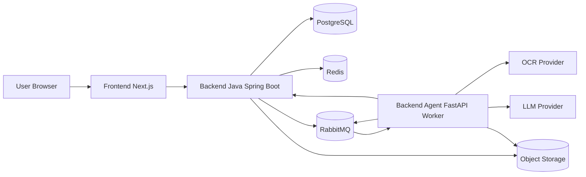
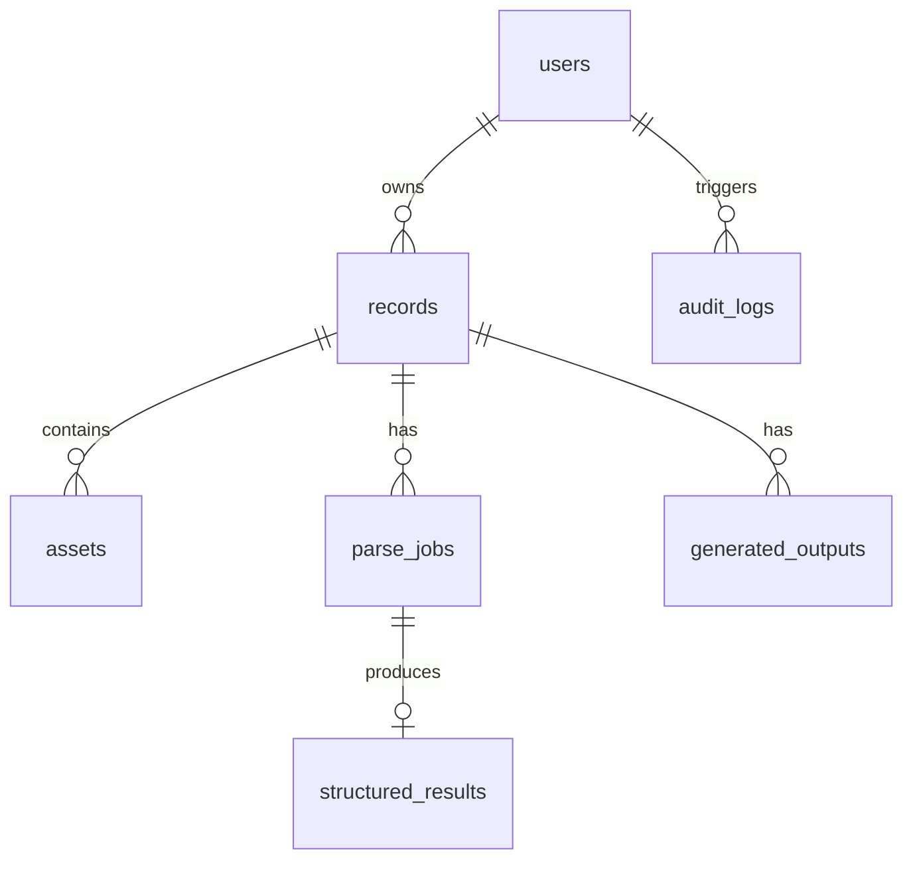
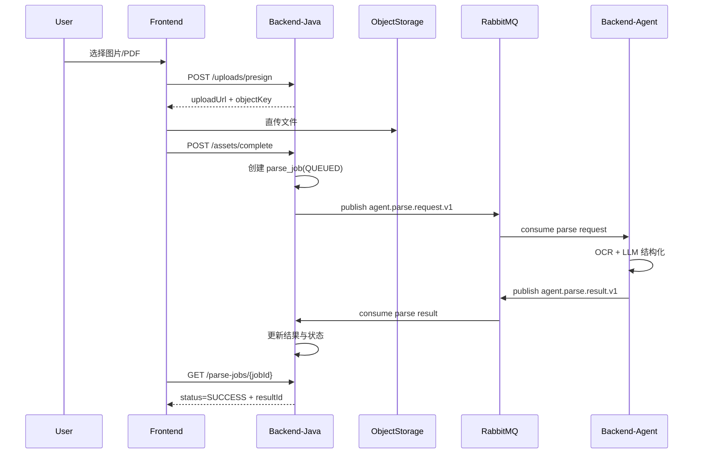
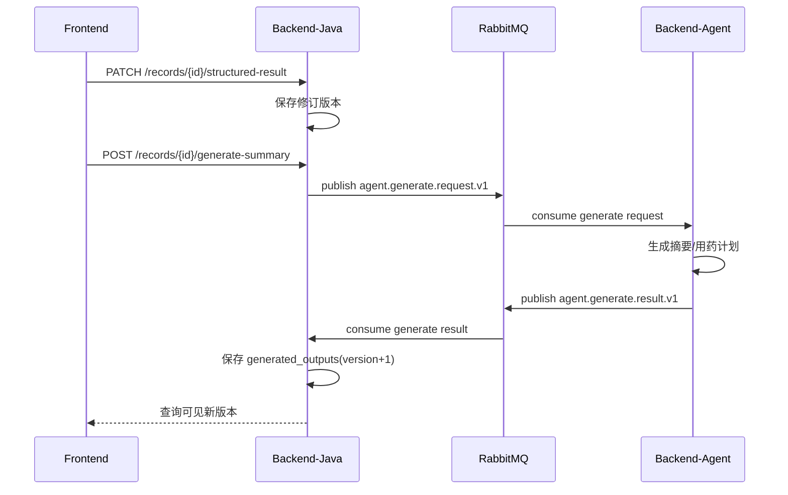

# 医疗 Agent Web 应用 MVP：技术方案与架构设计

## 1. 目标与边界

### 1.1 目标
- 支持用户上传图片/PDF，异步完成 OCR + LLM 解析。
- 产出结构化病历信息，并生成检查结果摘要和用药计划草案。
- 满足医疗数据的安全、审计、可追溯要求。

### 1.2 模块拆分（已确认）
- `frontend`：Web 前端（Next.js + TypeScript）。
- `backend-java`：主业务中台（Spring Boot），负责 Web 业务与数据真相。
- `backend-agent`：智能处理服务（Python FastAPI），负责 OCR/LLM 流程。

### 1.3 设计原则
- Reuse-first：复用成熟中间件和标准协议，避免重复造轮子。
- Compatibility-first：接口 schema 版本化，避免破坏既有契约。
- 异步优先：耗时任务（解析/生成）必须异步，不阻塞用户请求。
- 安全优先：默认最小权限、数据加密、全链路审计。

## 2. 技术选型

### 2.1 前端
- `Next.js` + `React` + `TypeScript`
- UI 建议：`Tailwind CSS`（快速迭代）
- 数据请求：`TanStack Query`

### 2.2 后端（业务中台）
- `Java 21` + `Spring Boot 3`
- `Spring Security`（JWT/OAuth2）
- `Spring Web` + `Validation` + `Actuator`
- ORM：`MyBatis-Plus` 或 `JPA`（二选一，MVP 建议 MyBatis-Plus）

### 2.3 Agent 服务
- `Python 3.11+` + `FastAPI`
- 模型编排：自研适配层（不绑定单一框架）
- OCR：云 OCR API（主）+ 备用供应商（降级）
- LLM：主模型 + fallback 模型路由

### 2.4 基础设施
- 数据库：`PostgreSQL`
- 缓存：`Redis`
- 消息队列：`RabbitMQ`
- 对象存储：`S3 兼容存储`（AWS S3/阿里云 OSS/腾讯 COS）
- 可观测：`OpenTelemetry` + `Prometheus` + `Grafana` + 日志系统（ELK/Loki）

### 2.5 搜索与检索
- MVP：`PostgreSQL FTS`（先满足关键词检索）
- 后续：`OpenSearch/Elasticsearch`（高阶检索与聚合）

## 3. 架构设计

### 3.1 架构形态
- 对外是 2 个后端服务（Java 业务服务 + Python Agent 服务）。
- Java 服务内部保持模块化单体（避免过早拆分微服务）。
- 采用事件驱动的轻量模式：关键节点发事件，异步解耦。

### 3.2 是否多租户
- MVP 不启用复杂多租户隔离。
- 数据模型预留 `tenant_id` 字段，便于后续升级 B2B 多租户。

### 3.3 组件关系图（Mermaid）

### 3.4 核心流程
- 上传：前端向 Java 请求预签名 URL，文件直传对象存储。
- 编排：Java 写入 `assets/parse_jobs`，推送 MQ。
- 处理：Agent 消费任务，执行 OCR + 结构化 + 生成。
- 回写：Agent 回调 Java 或发完成事件，Java 持久化结果。
- 展示：前端轮询或 SSE 获取任务状态和结果。

## 4. 接口设计（概要）

### 4.1 前端 <-> Java API（对外）

#### 上传相关
- `POST /api/v1/uploads/presign`
  - 入参：`fileName` `contentType` `size`
  - 出参：`uploadUrl` `objectKey` `expireAt`
- `POST /api/v1/assets/complete`
  - 入参：`objectKey` `checksum` `recordId?`
  - 出参：`assetId`

#### 解析任务
- `POST /api/v1/parse-jobs`
  - 入参：`assetIds[]` `recordId`
  - 出参：`jobId` `status=QUEUED`
- `GET /api/v1/parse-jobs/{jobId}`
  - 出参：`status` `progress` `errorCode?` `resultId?`

#### 结果与生成
- `GET /api/v1/records/{recordId}`
- `PATCH /api/v1/records/{recordId}/structured-result`
  - 入参：字段修订内容 + `version`
- `POST /api/v1/records/{recordId}/generate-summary`
- `POST /api/v1/records/{recordId}/generate-medication-plan`

### 4.2 Java <-> Agent 内部接口（服务间）

#### Agent 任务提交（推荐消息为主）
- MQ Topic: `agent.parse.request.v1`
  - Payload: `jobId` `tenantId` `userId` `assetRefs[]` `traceId`

#### Agent 回执（事件）
- MQ Topic: `agent.parse.result.v1`
  - Payload: `jobId` `status` `structuredResult` `confidence` `errors[]`

#### 同步兜底接口（管理/重试）
- `POST /internal/v1/agent/jobs/{jobId}/retry`
- `GET /internal/v1/agent/jobs/{jobId}/health`

### 4.3 契约规范
- 响应统一：`code` `message` `requestId` `data`
- 幂等键：`Idempotency-Key`（创建任务、生成内容接口必需）
- 超时策略：
  - Java -> Agent HTTP: 3s connect / 15s read
  - Agent 外部模型调用：可配置，默认 60s，超时重试最多 2 次
- 错误码分层：
  - `BIZ_*`（业务）
  - `EXT_*`（外部依赖）
  - `SEC_*`（权限/安全）

## 5. 数据模型设计（核心表）

### 5.1 逻辑 ER（简化）

### 5.2 表设计要点
- `users`
  - `id` `tenant_id` `account` `status` `created_at`
- `records`
  - `id` `tenant_id` `user_id` `record_date` `title` `source_type` `created_at`
- `assets`
  - `id` `tenant_id` `record_id` `object_key` `file_type` `file_size` `checksum` `created_at`
- `parse_jobs`
  - `id` `tenant_id` `record_id` `status` `progress` `retry_count` `error_code` `created_at` `updated_at`
- `structured_results`
  - `id` `tenant_id` `job_id` `schema_version` `payload_json` `confidence_score` `created_at`
- `generated_outputs`
  - `id` `tenant_id` `record_id` `type(summary/med_plan)` `version` `content` `model_meta` `created_at`
- `audit_logs`
  - `id` `tenant_id` `user_id` `action` `resource_type` `resource_id` `ip` `created_at`

### 5.3 索引建议
- `records(user_id, record_date desc)`
- `assets(record_id)`
- `parse_jobs(record_id, status, created_at desc)`
- `generated_outputs(record_id, type, version desc)`
- `audit_logs(user_id, created_at desc)`

## 6. 时序图（关键链路）

### 6.1 上传并触发解析

### 6.2 用户修订并生成摘要/用药计划

## 7. 非功能性设计

### 7.1 性能
- 上传 API（不含直传）P95 < 2s。
- 解析与生成端到端 P95 <= 90s（MVP 目标）。
- 单任务超时可配置，默认 120s，超过进入失败重试。

### 7.2 可用性
- Java 与 Agent 均无状态，至少 2 副本部署。
- MQ 配置死信队列（DLQ）与指数退避重试。
- 外部依赖（OCR/LLM）熔断和降级。

### 7.3 扩展性
- Agent worker 水平扩展；按队列分优先级（解析/生成）。
- Schema 版本化：`schema_version` 支持双读。
- 为后续多租户与搜索引擎升级预留字段与接口。

### 7.4 安全与合规
- 传输层 TLS，存储层加密（对象存储 SSE + DB 磁盘加密）。
- 严禁在应用日志写入完整病历原文。
- 最小权限控制（RBAC）+ 审计日志不可篡改策略。
- 明确用户提示：AI 内容仅供参考，不替代医生建议。
- 支持数据删除和导出流程（合规请求）。

### 7.5 成本
- 费用大头来自 OCR/LLM 调用。
- 优化策略：
  - OCR 质量分层，低价值内容不走高价模型。
  - 模型路由按任务类型与长度动态选择。
  - 结果缓存与去重，避免重复生成。

## 8. 风险清单与缓解

| 风险 | 影响 | 缓解措施 |
|---|---|---|
| OCR 质量波动 | 结构化错误 | 多供应商兜底 + 低置信高亮人工确认 |
| LLM 幻觉/不稳定 | 输出不可信 | 严格模板 + 结构化约束 + 规则校验 |
| 外部依赖超时 | 任务堆积 | 超时熔断 + 重试上限 + DLQ 人工处理 |
| 敏感数据泄露 | 合规与品牌风险 | 全链路加密 + 脱敏日志 + 审计与最小权限 |
| 成本超预算 | 无法持续运营 | 模型分层路由 + 限流 + 成本告警 |
| 接口变更破坏兼容 | 前后端故障 | 契约版本化 + 双读双写过渡 |
| 队列积压 | 延迟升高 | 分队列优先级 + 消费者自动扩容 |
| 数据删除不彻底 | 合规风险 | 删除编排任务 + 对象存储版本清理策略 |

## 9. 交付物清单（可直接执行）

- 架构图：本文件 3.3 与 5.1（Mermaid，可直接渲染）。
- 接口设计：本文件第 4 节（可转 OpenAPI）。
- 数据模型：本文件第 5 节（可落 DDL）。
- 时序图：本文件第 6 节。
- 风险清单：本文件第 8 节。

## 10. 下一步落地建议

- 先冻结 `Java <-> Agent` 的 JSON Schema v1（最优先）。
- 建立最小链路 PoC：上传 -> 解析 -> 回写 -> 前端展示。
- 并行补齐：鉴权、审计、埋点、告警阈值与 Runbook。
